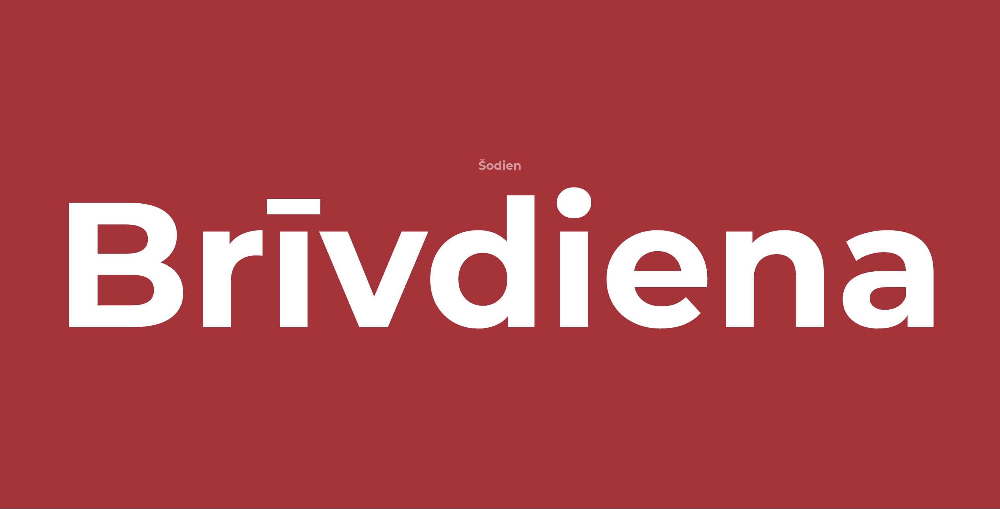

# Latvijas Brīvdienas (Latvian Holidays)

A simple Next.js application to check whether a given date is a public holiday in Latvia.

## Preview

| Holiday                                  | Working Day                                     |
| ---------------------------------------- | ----------------------------------------------- |
|  |  |

## Features

- **Homepage**: Displays whether today is a holiday or working day in Latvia
- **API Endpoint**: Query any date in YYYY-MM-DD format to check if it's a holiday

## Setup

### Installation

1. Clone the repository
2. Install dependencies:

```bash
pnpm install
```

3. Run the development server:

```bash
pnpm dev
```

4. Open [http://localhost:3000](http://localhost:3000) in your browser

### Build for Production

```bash
pnpm build
pnpm start
```

## API

### GET /api/[date]

Check if a specific date is a public holiday in Latvia.

#### Parameters

- `date` (required) - Date in `YYYY-MM-DD` format (e.g., `2026-05-01`)

#### Example Request

```bash
curl http://localhost:3000/api/2026-11-18
```

#### Example Success Response (200)

```json
{
  "success": true,
  "date": "2026-11-18",
  "isHoliday": true
}
```

#### Example Success Response (200) - Not a Holiday

```json
{
  "success": true,
  "date": "2026-04-30",
  "isHoliday": false
}
```

#### Example Error Response (400)

```json
{
  "success": false,
  "error": "Invalid date format"
}
```

or

```json
{
  "success": false,
  "error": "Failed to fetch holidays: Internal Server Error"
}
```

### Error Codes

- `200` - Success (both holiday and non-holiday dates)
- `400` - Bad Request (invalid date format or API error)

## Data Source

Holiday data is fetched from the [Prompt.lv API](https://api.prompt.lv):

```
https://api.prompt.lv/api/v1/info/holidays/LV/{year}
```
